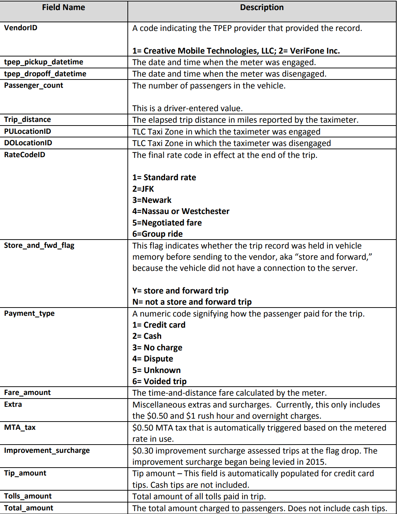
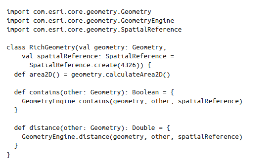
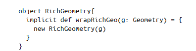
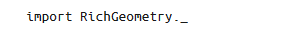

# Spark_practice
 big data practice use spark 1.6.0

部分参考资料：[图灵程序设计丛书].Spark高级数据分析.第2版（主目录下）

https://github.com/jwills/geojso

## Basic shell command

创建HDFS上的文件目录

`hadoop fs -mkdir linkage`

将本地文件上传至HDFS的目录下

`hadoop fs -put block_*.csv linkage`

在Hadoop集群上部署spark

`spark-shell --master yarn --deploy-mode client`

在本地计算机上启动本地集群

`spark-shell --master local[*]`

等效于：

`spark-shell`

http://DESKTOP-*****:4040

`:help`

`:h?`

`:historay`

## SparkContext

SparkContext 是一个spark自带对象

查看该对象的所有方法：

`sc.[\t]`

([\t])是tab键

### 创建RDD

RDD 以分区（partition）的形式分布在集群中的多个机器上，每个分区代表了数据集的一个子集。分区定义了Spark 中数据的并行单位。Spark 框架并行处理多个分区，一个分区内的数据对象则是顺序处理。创建RDD 最简单的方法是在本地对象集合上调用SparkContext 的parallelize 方法。

`val rdd = sc.parallelize(Array(1, 2, 2, 4), 4)`

第一个参数代表待并行化的对象集合，第二个参数代表分区的个数。

要在分布式文件系统（比如HDFS）上的文件或目录上创建RDD，可以给textFile 方法传入文件或目录的名称：

`val rdd2 = sc.textFile("hdfs:///some/path.txt")`

我们的记录关联数据存储在一个文本文件中，文件中每行代表一个样本。我们用SparkContext 的textFile 方法来得到RDD 形式的数据引用：

#### val、var

只要在Scala 中定义新变量，就必须在变量名称前加上val 或var。名称前带val 的变量是不可变变量。一旦给不可变变量赋完初值，就不能改变它，让它指向另一个值。而以var 开头的变量则可以改变其指向，让它指向同一类型的不同对象。

## 纽约市出租车分析

### 数据描述：

数据来源：

https://www1.nyc.gov/site/tlc/about/tlc-trip-record-data.page

共有四种出租车，这里选取数据为黄色出租车数据，

数据集为**2020年1月到2020年6月**六个csv文件

数据集在`./data`文件夹下

数据集说明在`./data_dic`文件夹下

### 地理数据API：Esri Geometry API

我们有出租车乘客上车点和下车点的经纬度 数据，以及表示纽约各个区边界的矢量数据，这些矢量数据用 GeoJSON 格式存储。因我们需要一个可以解析 GeoJSON 数据并能处理其空间关系的工具。具体来说，就是该工 具可以判断某经纬度所代表的点是否在某个区边界所组成的多边形中。

不幸的是，目前没有一个开源的库正好能满足我们的要求。有一个 GeoJSON 的解析工具 可以把 GeoJSON 转换成 Java 对象，但没有相关的地理空间工具能对转换得到的对象进行 空间关系分析。有一个名叫 GeoTools 的项目，但它的组件和依赖关系实在太多，我们不 希望在 Spark shell 中选用有太多复杂依赖的工具。最后有一个 Java 版本的 Esri Geometry API，它的依赖很少而且可以分析空间关系，但它只能解析 GeoJSON 标准的一个子集，因此我们必须对下载的 GeoJSON 数据做一些预处理。

https://github.com/jwills/geojson

对该项目来讲，我们有表示出租车乘客下车地点（经度和纬度）的几何图形，也有表示纽约市行政区域范围的几何图形。我们想知道它们的包含关系：一个给定的位置点是否在曼哈顿区对应的多边形里边？

Esri  API有一个助手类GeometryEngine，它提供了执行所有空间关系操作的静态方法，其中就包括contains操作。contains方法有3个参数：两个Geometry实例参数和一个SpatialReference实例参数。SpatialReference实例参数表示用于地理空间计算的坐标系统。为了提高精度，我们需要分析地球球体上的点映射到二维坐标系统后相对于坐标平面的空间关系。地理空间工程师有一套标准的通用标识符（well-known  identifier，称为WKID），是一套最常用的坐标系统。这里我们将采用WKID  4326，它也是GPS所用的坐标系统。

作为Scala开发人员，我们总是想方设法减少在Spark  shell中进行交互式数据分析时输入的代码量。在Spark  shell中可不像Eclipse和IntelliJ那样能自动为我们补全长方法名，也不能像这些开发环境一样提供语法糖来辅助看懂某种操作。根据**NScalaTime**库（它定义了包装类**RichDateTime**和**RichDuration**）的命名规范，我们将定义自己的***RichGeometry***类，它扩展了Esri Geometry对象并提供一些有用的辅助方法，代码如下：

我们将为Geometry定义一个伴生对象，它可以将Geometry类实例隐式转换为RichGeometry类型：

记住，要想这种转换起作用，需要在Scala环境中导入这个隐式函数定义，代码如下：

### GeoJSON简介

表示纽约市行政区域范围的数据是GeoJSON格式的，GeoJSON中核心的对象称为特征，特征由一个geometry实例和一组称为属性（property）的键-值对组成。其中geometry可以是点、线或多边形。一组特征称为FeatureCollection。现在我们把纽约市行政区地图的GeoJSON数据下载下来，然后看看它的结构。

 https://nycdatastables.s3.amazonaws.com/2013-08-19T18:15:35.172Z/nyc-borough-boundaries-polygon.geojson 

可以用Esri  Geometry  API解析每个特征内部的几何JSON，*但这个API不能帮我们解析id或properties字段*，properties字段可能是任何JSON对象。为了解析这些对象，要用到Scala的JSON库，这样的库有很多。

这里正好可以用Spray，它是一个用Scala构建Web服务的开源工具包。通过隐式调用spray-json的toJson方法，可以将任何Scala对象转换成相应的JsValue。也可以通过调用它的parseJson方法将任何JSON格式的字符串转换成一个中间类型，然后在中间类型上调用convertTo[T]将其转换成一个Scala类型T。Spray内置了对常用Scala原子类型、元组和集合类型的转换实现，同时也提供了一个格式化工具，该工具可以定义自定义类型（比如RichGeometry）与JSON之间相互转换的规则。

首先为表示GeoJSON的特征将建立一个case类。根据规范，特征是一个JSON对象，它必须有一个geometry字段和一个properties字段。geometry代表GeoJSON的几何类型，properties则是一个JSON对象，可以包含任意个数和类型的键-值对。特征也可以有一个可选字段id，表示任何JSON标识符。我们的case类的Feature将为每个JSON字段定义相应的Scala字段，同时它还提供了在属性map中查找值的辅助方法：